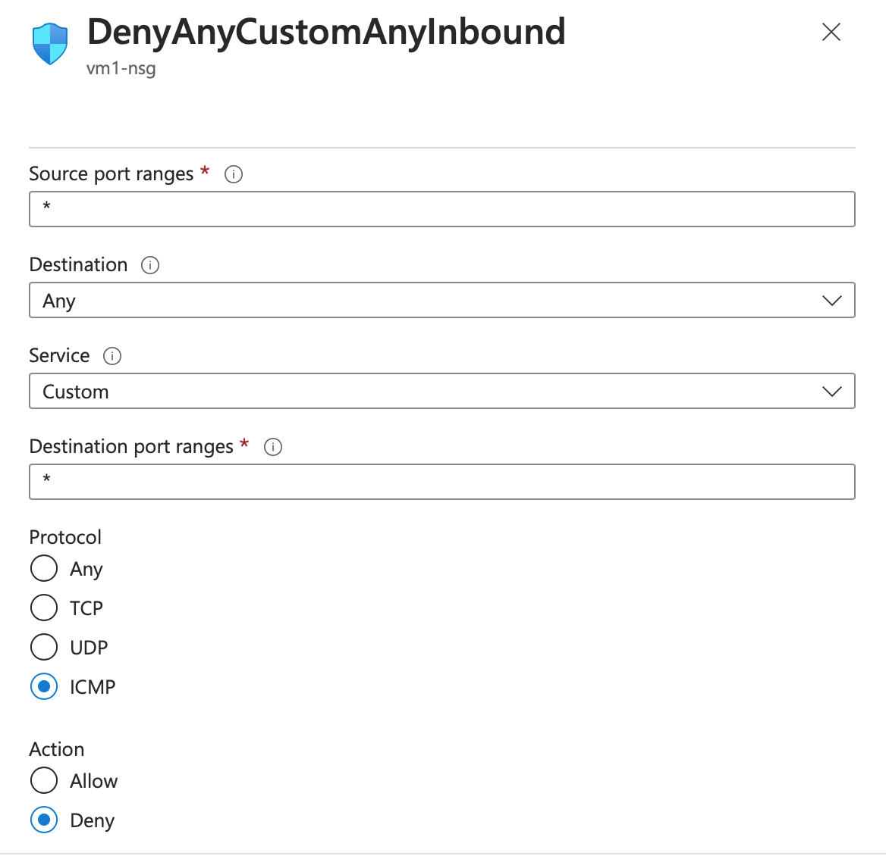

<h1>Network Security Groups (NSGs) and Inspecting Traffic Between Azure Virtual Machines</h1>
In this tutorial, we observe various network traffic to and from Azure Virtual Machines with Wireshark as well as experiment with Network Security Groups.  

<h2>Environments and Technologies Used</h2>

- Microsoft Azure (Virtual Machines/Compute)
- Remote Desktop
- Various Command-Line Tools
- Various Network Protocols (SSH, RDH, DNS, HTTP/S, ICMP)
- Wireshark (Protocol Analyzer)

<h2>Operating Systems Used </h2>

- Windows 10 (21H2)
- Ubuntu Server 20.04

<h2>High-Level Steps</h2>

- Creating Our Resources 
- Observe ICMP Traffic
- Observe SSH, DHCP, DNS, and RDP Traffic
- Cleanup

<h2>Actions and Observations</h2>

Part 1: Create our Resources

To begin, we need to create the necessary resources in Microsft Azure. Start by creating a Resource Group, which will serve as a logical container for our virtual machines and other associated resources.

Next, create a Windows 10 Virtual Machine (VM) within the Resource Group. During the VM creation process, remember to select the previously created Resource Group. Additionally, allow the VM to create a new Virtual Network (Vnet) and Subnet.

Similarly, create a Linux (Ubuntu) VM and select the previously created Resource Group and Vnet. This will ensure that the VMs are connected within the same network.

Finally, observe your Virtual Network within Network Watcher to verify the network configuration.

 

Part 2: Observe ICMP Traffic

In this part, we will focus on observing ICMP (Internet Control Message Protocol) traffic using Wireshark.

First, use Remote Desktop to connect to your Windows 10 Virtual Machine. Once connected, install Wireshark within the VM.

Open Wireshark and apply a filter to display only ICMP traffic. This will help us isolate and analyze the ICMP packets.

Retrieve the private IP address of the Ubuntu VM and attempt to ping it from within the Windows 10 VM. While doing so, keep an eye on Wireshark to observe the ping requests and replies in the captured traffic.

Next, from the Windows 10 VM, open the command line or PowerShell and attempt to ping a public website, such as www.google.com. Monitor the traffic in Wireshark to observe the communication.

To further explore ICMP traffic, initiate a perpetual/non-stop ping from the Windows 10 VM to the Ubuntu VM. However, before doing so, access the Network Security Group associated with the Ubuntu VM and disable incoming (inbound) ICMP traffic.

Return to the Windows 10 VM and observe the ICMP traffic in both Wireshark and the command line Ping activity. 

Then, re-enable ICMP traffic for the Network Security Group of the Ubuntu VM and observe the changes in the ICMP traffic.

Finally, stop the ping activity to conclude this part.

 

Part 3: Observe SSH, DHCP, DNS, and RDP Traffic

Now we will explore the traffic related to SSH, DHCP, DNS, and RDP protocols.

Using Wireshark, apply the respective filters to observe each type of traffic individually. Perform the following activities to analyze the traffic patterns:

1.SSH Traffic: Establish an SSH connection by opening the command line or terminal on your Windows 10 VM. Type the command ssh username@ubuntu_vm_private_ip, replacing username with your actual username and ubuntu_vm_private_ip with the private IP address of your Ubuntu VM. 

Press Enter to initiate the SSH connection. Observe the SSH traffic in Wireshark while entering commands and when exiting the SSH connection.

(Try the rest on your own, steps attached)  

2.DHCP Traffic: Open the command line or terminal on your Windows 10 VM. Type the command ipconfig /renew and press Enter to issue a DHCP request and attempt to obtain a new IP address. Observe the DHCP traffic appearing in Wireshark.

3.DNS Traffic: Open the command line or terminal on your Windows 10 VM. Use the command nslookup google.com to perform a DNS lookup for google.com. Press Enter to execute the command and observe the DNS traffic in Wireshark. Repeat the same steps for disney.com or any other domain you want to look up.

4.RDP Traffic: Apply the filter tcp.port == 3389 in Wireshark to display RDP (Remote Desktop Protocol) traffic. Observe the continuous stream of traffic and consider why RDP traffic appears to be non-stop spamming.
  

 

Cleanup

After completing all the instructions, make sure to perform the necessary cleanup steps:

1.Close your Remote Desktop connection.
2.Delete the Resource Group(s) created at the beginning of this lab to remove all associated resources.

3.Verify the successful deletion of the Resource Group(s).

By following these instructions, you will have successfully completed this project and gained valuable experience in observing network traffic using Wireshark.

 

